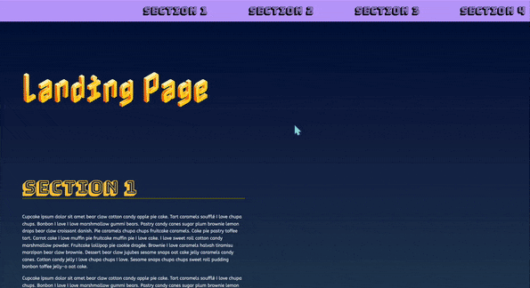

# DOM Manipulation: Landing Project

This project uses DOM manipulation & JS methods to create the navigation menu dynamically based on the sections from the HTML file. 

An event listener is then added to the links within the menus to scroll smoothly to the sections linked to it. 

Uses a function and loops through the section elements adding an active state to the section currently visible within the viewport.

Uses the getBoundingClientRect() method to check if a section is in the viewport.

Then uses the scrollIntoView() method to smoothly scroll to the section clicked from the corresponding nav link within the navigation menu.

**Link to live project:** https://shimmering-queijadas-f8656a.netlify.app/

 

## How It's Made:
*Tech used:*  HTML, CSS, JavaScript
- Includes some fun lorem ipsum from:
[Cupcake ipsum](https://cupcakeipsum.com/paragraphs/1/length/long/with_love/true/start_with_cupcake/true/seed/374800f988ebcc19b9b6228b35ca5134325d7d76daee4c2699a2a76fb5e106f2)

[Fun Generators](https://fungenerators.com/lorem-ipsum/ramen/)
    - Ramen ipsum, Coffee ipsum, Hippie Ipsum
## Lessons Learned:
DOM manipulation using JavaScript methods. 
- Helped with understanding how to get each section into view. 

## Golden Resources:

[MDN Web Docs: Web APIs] (https://developer.mozilla.org/en-US/docs/Web/API) 

[Borislav Hadzhiev Blog] (https://bobbyhadz.com/blog/javascript-get-element-by-data-attribute)

[Javascript.info] (https://javascript.info/array-methods#iterate-foreach)

[FreeCodeCamp: Callback Functions] (https://www.freecodecamp.org/news/javascript-callback-functions-what-are-callbacks-in-js-and-how-to-use-them/)

## Special Thanks
Thanks to @xoLadybugs, Kameron Watts & Cappreccia who helped me when I was struggling to understand some concepts of simplifying my code. 

Thanks to Rocky, Sharynne for being awesome instructors and being available to always help. 

Thanks to Lindsey & Bolu for cheering us on and checking in with me to make sure I completed my assignments to graduate.

Thanks to all of the awesome people reviewing my code and giving me feedback to improve and become a better developer.

This process was super difficult and I could not have done it without the awesome community of folks within the Udacity ecosystem. 

Thanks so much! 😄